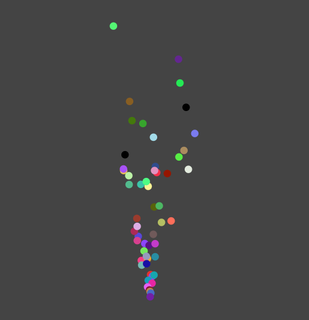

# Particles with React

This code

```javascript
 <ParticleProvider>
    <ParticleSvg>
        <ShowParticles />
        <Emitter x={0} y={0} />
    </ParticleSvg>
  </ParticleProvider>
```

Generates this:



Demo: https://spidgorny.github.io/particles-harpa

You could build Emitters of various types. The emitter above works like this:

```typescript
  useEffect(() => {
    const timer = setInterval(() => {
      let pos = new Victor(x, y);
      let r1 = Math.random() - 0.5;
      let r2 = Math.random() - 0.5;
      let vel = new Victor(r1, r2 - 2);
      let color = Math.floor(Math.random() * 0xffffff)
        .toString(16)
        .substring(0, 6);
      // console.log("emit", pos, vel);
      let lifeTime = Math.random() * 3_000 + 1000;
      addParticle(new Particle(pos, vel, { color, lifeTime }));
    }, 50);
    return () => clearTimeout(timer);
  }, [addParticle, x, y]);
```

Explanation: runs 20 times per second, each time makes a new particle at the position (0, 0), 
with impulse to go mostly upwards. Color is random. The particle should die somewhere between 1 
and 4 seconds after birth.
